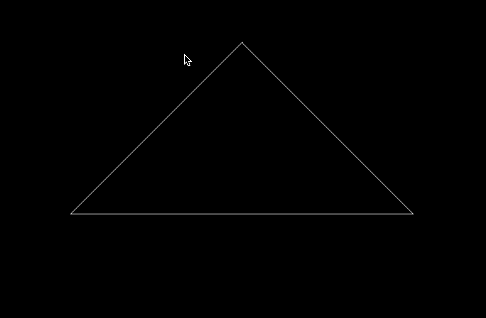

# Overview
The goal for this peoject is implementing Model-View-Projection (MVP) matrix transformation technique to convert a 3D triangle with a user-defined position into its corresponding screen position, thereby enabling its display on the screen. 

# development environment

- build system generator: [CMake](https://cmake.org/)
- build system: [Ninja](https://ninja-build.org/)
- compiler: [GCC 12.2.0 aarch64-apple-darwin22](https://linux.die.net/man/1/gcc)
- Integrated Development Environment (IDE): [Visual Studio Code](https://code.visualstudio.com/) 
- C++ libraries:
  - C++ Standard Library
  - [Eigen3](https://eigen.tuxfamily.org/index.php?title=Main_Page)
  - [openCV2](https://opencv.org/)
- package manager: [vcpkg](https://github.com/Microsoft/vcpkg)
- version control system (VCS): [Git](https://git-scm.com/)

# Method 
## model/view transformation
Model transformation is transforming a 3D object in the local space to world space. There also include rotation because we should setup camera up at Y axis and look at -Z axis. We should impelement model/view transformation in both camera and object, in the code I just use translate matrix to translate them into original position (get_view_matrix). 

## projection transformation
There are two different projection : **[perspective projection](https://www.geeksforgeeks.org/perspective-projection-and-its-types/)** & **[othrographic projection](https://en.wikipedia.org/wiki/Orthographic_projection)**
### othrographic projection
This projection is scaling object into canonical cube, I do it frist move the center to original point, and then scale it in 1 $\times$ 1 $\times$ 1 cube, here is the matrix:

$$
 M_{ortho} = 
  \begin{bmatrix}
  \frac{2}{r-1}&0&0&0\\
  0&\frac{2}{t-b}&0&0\\
  0&0&\frac{2}{n-f}&0\\
  0&0&0&1\\
  \end{bmatrix} 
  \begin{bmatrix}
  1&0&0&-\frac{r+1}{2}\\
  0&1&0&-\frac{t+b}{2}\\
  0&0&1&-\frac{n+f}{2}\\
  0&0&0&1\\
  \end{bmatrix} 
$$

### perspective projection
I do it first with perspective->othrographic matrix, there is the [calculation process](https://sites.cs.ucsb.edu/~lingqi/teaching/resources/GAMES101_Lecture_04.pdf)
After calculating perspective->othrographic matrix, multiply it with othrographic matrix.

$$
M_{persp} = M_{ortho}M_{persp->ortho}
$$

$$
M_{persp->ortho} = 
   \begin{bmatrix}
   n&0&0&0\\
   0&n&0&0\\
   0&0&n+f&-nf\\
   0&0&1&0\\
   \end{bmatrix}
$$

$$
 M_{ortho} = 
  \begin{bmatrix}
  \frac{2}{r-1}&0&0&0\\
  0&\frac{2}{t-b}&0&0\\
  0&0&\frac{2}{n-f}&0\\
  0&0&0&1\\
  \end{bmatrix} 
  \begin{bmatrix}
  1&0&0&-\frac{r+1}{2}\\
  0&1&0&-\frac{t+b}{2}\\
  0&0&1&-\frac{n+f}{2}\\
  0&0&0&1\\
  \end{bmatrix} 
$$
## Canonical cube to screen
transform in xy plane: $[-1,1]^{2}$ to $[0,width]\times[0,height]$

$$
M_{Viewport} = 
   \begin{bmatrix}
   \frac{width}{2}&0&0&\frac{width}{2}\\
   0&\frac{height}{2}&0&\frac{height}{2}\\
   0&0&1&0\\
   0&0&0&1\\
   \end{bmatrix}
$$

## rotate in any axis
[Rodrigues’ Rotation Formula](https://en.wikipedia.org/wiki/Rodrigues%27_rotation_formula)
Rotation by angle $\alpha$ around axis $n$

$$
R(n,\alpha) =
 cos(\alpha)I + (1-cos(\alpha))\times n \times n^{T} + sin(\alpha) \times 
 \begin{bmatrix}
   0&-n_{z}&n_{y}\\
   n_{z}&0&-n_{x}\\
   -n_{y}&n_{x}&0\\
\end{bmatrix}
$$

# Result
Show a triangle on the screen

Press A & D to rotate this triangle

# Building
```
# Setup environment 

# Download repository
$ git clone git@github.com:Yuqian-He/model-view-projection.git
$ cd model-view-projection

# Configure and build project
$ mkdir build
$ cd build
$ cmake .. 
$ make

# Run the program
$ ./Rasterizer
```
